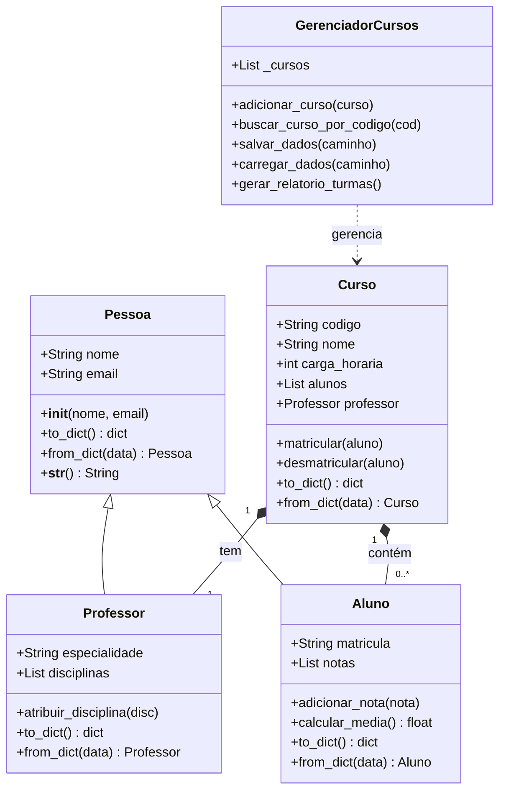

# 🎓 Sistema de Gerenciamento de Cursos e Matrículas


Sistema CLI desenvolvido em **Python puro** aplicando **Programação Orientada a Objetos (POO)** para gerenciar professores, alunos, cursos, matrículas e médias acadêmicas. Interface moderna com `rich`, persistência automática em `JSON` e estrutura modular pronta para escalar.

---

## ✨ Funcionalidades
- 👨‍🏫 Cadastro de professores com validação de email
- 👨‍🎓 Cadastro de alunos com geração automática de matrícula
- 📚 Criação de cursos vinculados a professores e carga horária
- 📝 Matrícula e desmatriculação com confirmação de segurança
- 📊 Registro de notas e cálculo automático de médias individuais/turma
- 🔍 Listagem tabulada de cursos e relatório acadêmico formatado
- 💾 Persistência automática em JSON (carrega ao iniciar, salva ao sair)
- 🎨 Interface terminal moderna com cores, painéis, tabelas e spinners

---

## 📦 Instalação & Setup

### 1. Clone o repositório
```bash
git clone https://github.com/seu-usuario/gerenciador-cursos.git
cd gerenciador-cursos
```

### 2. Crie um ambiente virtual (recomendado)
```bash
python -m venv .venv
source .venv/bin/activate  # Linux/macOS
.venv\Scripts\activate     # Windows
```

### 3. Instale as dependências
```bash
pip install -r requirements.txt
```

---

## 🚀 Como Executar

```bash
python main.py
```

### 📝 Fluxo de Cadastro Recomendado
1. `1` → Cadastre um **Professor**
2. `3` → Crie um **Curso** vinculando o professor
3. `2` → Cadastre um **Aluno**
4. `4` → **Matricule** o aluno no curso
5. `6` → Adicione **Notas** (o sistema calcula a média automaticamente)
6. `10` → **Saia** (os dados são salvos automaticamente em `dados_cursos.json`)

> 💡 Ao reabrir o sistema, os dados serão carregados automaticamente.

---

## 🏗️ Arquitetura do Projeto

```
gerenciador_cursos/
├── models/             # Entidades de negócio (POO pura)
│   ├── pessoa.py       # Classe base com validação e @property
│   ├── aluno.py        # Herda Pessoa, gerencia notas/média/matricula
│   ├── professor.py    # Herda Pessoa, gerencia disciplinas/especialidade
│   └── curso.py        # Agregação: contém Professor + lista de Aluno
├── services/           # Regras de negócio e persistência
│   └── gerenciador.py  # @classmethod/@staticmethod, JSON I/O
├── main.py             # CLI interativa com Rich
├── requirements.txt    # Dependências
└── README.md           # Documentação completa
```

---

## 🧠 Conceitos POO Aplicados

| Conceito | Aplicação no Projeto |
|----------|----------------------|
| **Herança** | `Aluno` e `Professor` herdam de `Pessoa`, reutilizando validação de email e `__str__` |
| **Encapsulamento** | Validação de dados via `@property` e setters protegidos (`self._email`) |
| **Agregação** | `Curso` referencia `Professor` e mantém lista de `Aluno` sem acoplamento forte |
| **Polimorfismo/Busca** | `@staticmethod` e `@classmethod` isolam regras de consulta do estado interno |
| **Serialização** | Métodos `to_dict()` e `from_dict()` convertem objetos ↔ JSON de forma segura |
| **Métodos Mágicos** | `__str__` e `__init__` personalizados para representação e inicialização limpa |

---

## 📊 Diagrama de Classes



---

## 📄 Licença
Distribuído sob a licença **MIT**. Veja `LICENSE` para mais detalhes.

---

## 📬 Autor
Feito por **[cashot01]**  
 [💻 GitHub](https://github.com/cashot01)